# Приложение для работы с АИС Магазин "Книги"

Приложение разработано на языке программирования C++ с использованием фреймворка Qt. База данных - PostgreSQL.

1. [Авторизация](#1-авторизация)
2. [Пользовательский интерфейс](#2-пользовательский-интерфейс)
3. [Интерфейс сотрудника](#3-интерфейс-сотрудника)
4. [Отчеты](#4-отчеты)

## 1. Авторизация

Авторизация пользователя или сотрудника в системе.

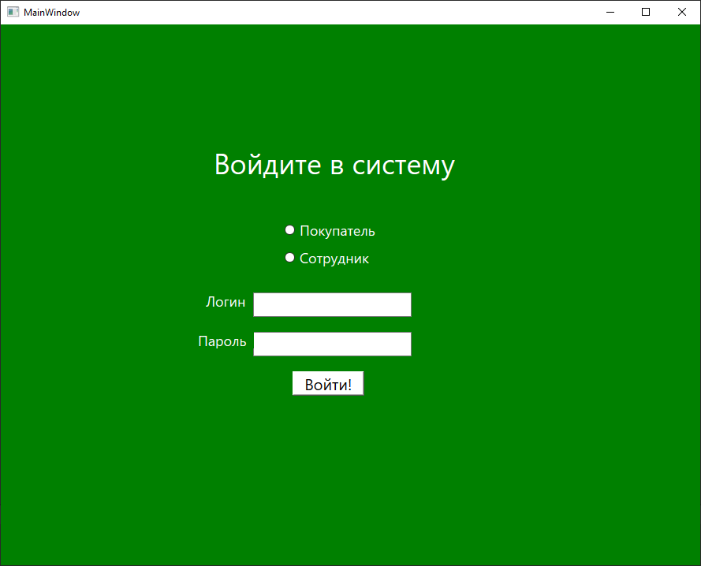

## 2. Пользовательский интерфейс

Пользовательский интерфейс позволяет клиентам узнавать информацию о книгах в магазине, смотреть свою историю заказов и оформлять новые.

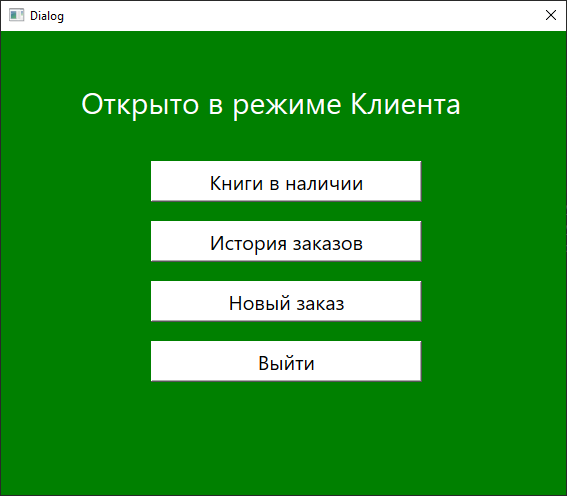
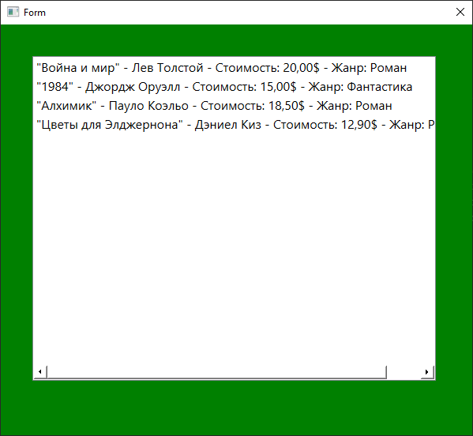
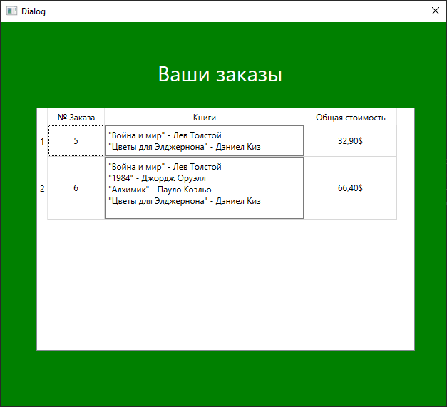
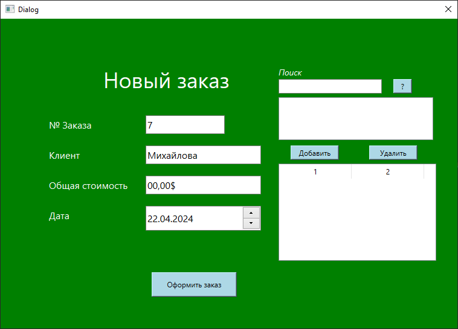

## 3. Интерфейс сотрудника

Позволяет сотрудникам добавлять различные записи в базу данных (заказы, книги, клиенты, другие сотрудники, издательства и поставщики), а также формировать необходимые отчеты (см. ниже).

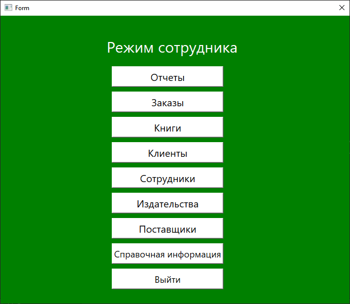
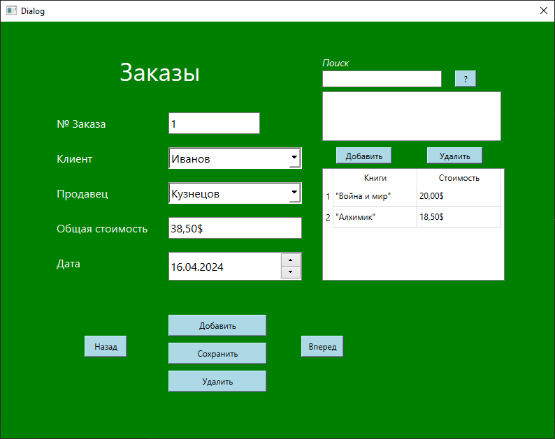
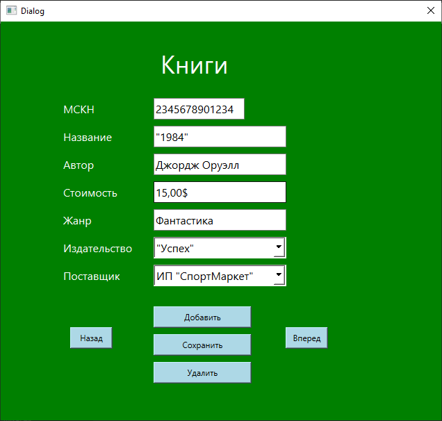
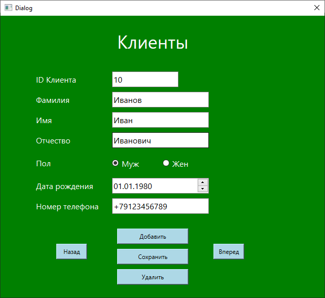
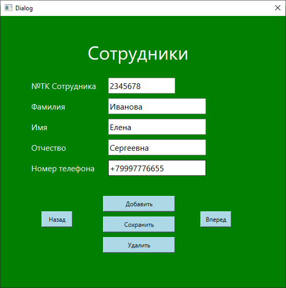
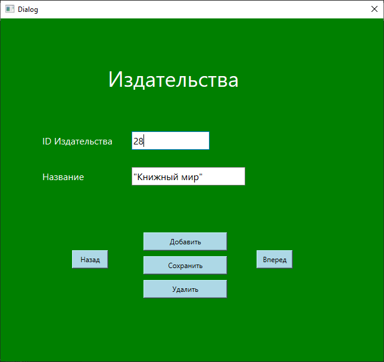
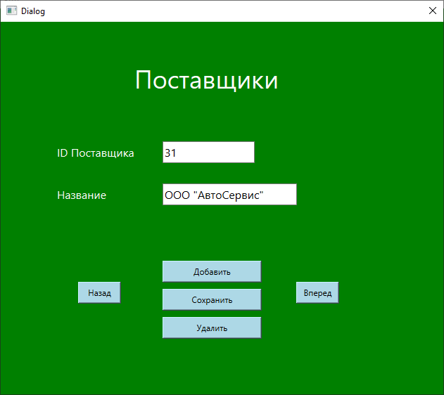
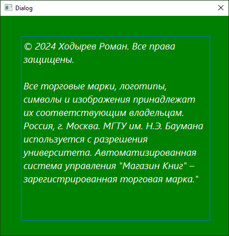

## 4. Отчеты

Позволяет сотруднику на основе заранее подготовленных запросов сформировать отчеты о всех книгах, об издательствах, о заказах в выбранный день, о заказах определенного клиента, а также создать гистограмму цен всех книг и круговую диаграмму транспортной способности поставщиков.

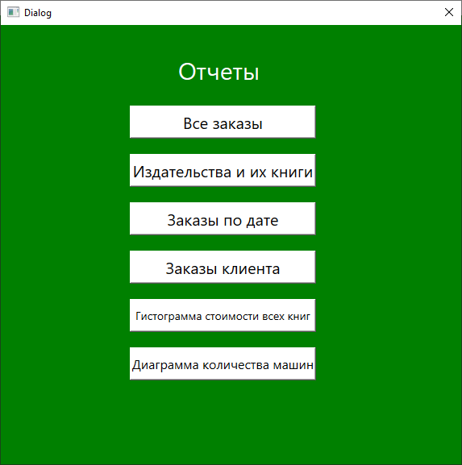
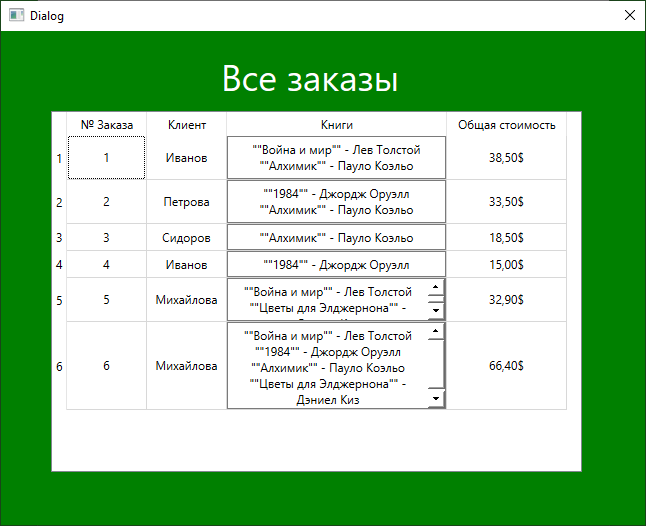
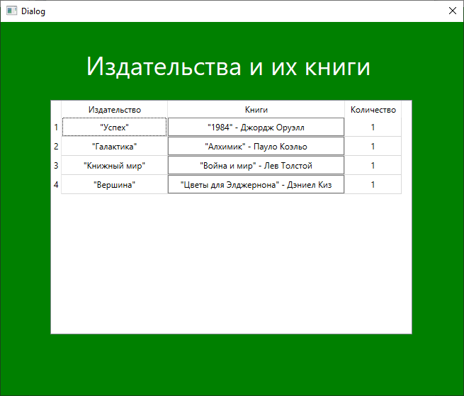
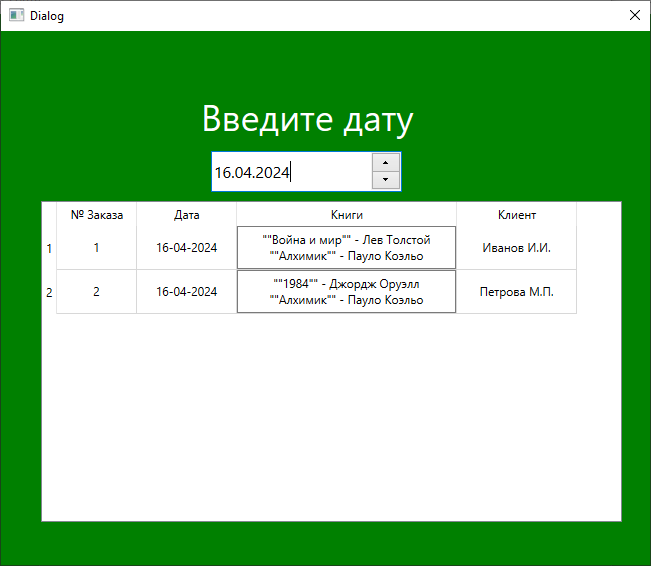
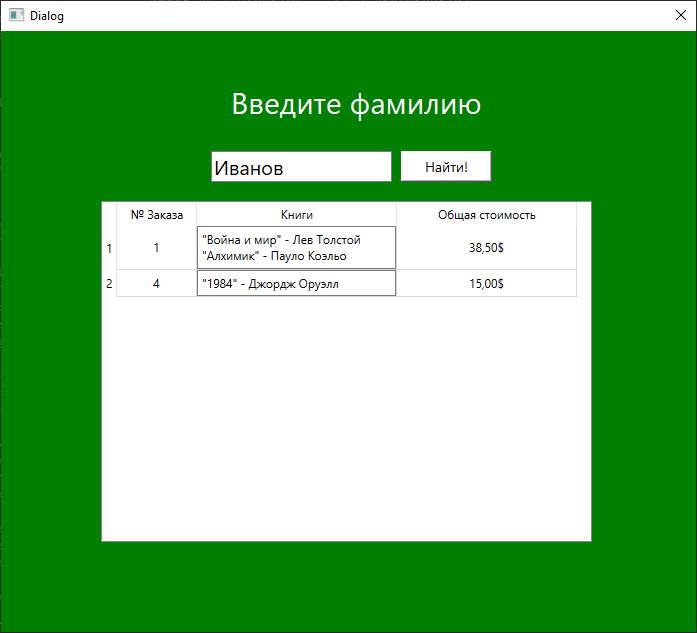
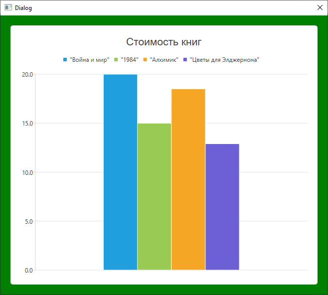
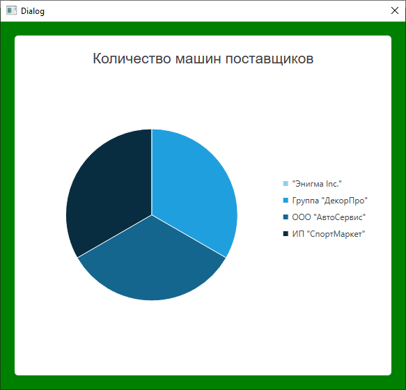
